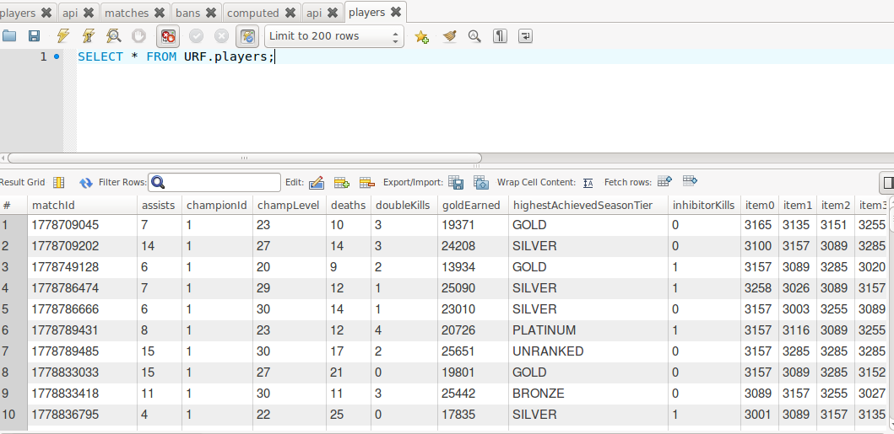

GetUrf
---

For the [Riot Games API Challenge](https://developer.riotgames.com/discussion/riot-games-api/show/bX8Z86bm).
Fetch URF match data and send to a database.



## Data Flow
1. Get 5 minute timestamps starting from `1427866500` (for `NA`).
2. Send timestamps to the endpoint `api-challenge-v4.1` to get a list of URF match IDs.
2. For each match ID, get match data from the endpoint `match-v2.2`.
3. Transform result (remove unused fields, etc).
    4. Create tables for matches, players, bans.
4. Save to the database (firebase -> local -> server db).
6. Figure out queries to send to site + Visualize (https://github.com/hzoo/urf).

## Setup
- [io.js](https://iojs.org/): `nvm install 1.6.3 && nvm use 1.6.3`
- ES6 with Babel
- MySQL 5.6 (local or server): `apt-get install mysql-server`
    + Setup a database and name it what you will put in `DB_NAME`.
    + Add all the tables from `./data/create-tables.js`

Create a json file at `./data/config.json`.

```js
{
    "LOL_REGION": "LOL-REGION-HERE", // ex: na
    "LOL_TOKEN": "LOL-API-TOKEN-HERE",
    "DB_HOST": "DB-HOST-HERE", // localhost unless you use a service
    "DB_USER": "DB-USER-HERE",
    "DB_PASSWORD": "DB-PASSWORD-HERE",
    "DB_NAME": "DB-DATABASE-NAME",
    "SSL_CA": "blah.pem",
    "SSL_CERT": "blah.pem",
    "SSL_KEY": "blah.pem"
}
```

run `npm start`

## Structure
- `npm start` runs `fetch/index.js`
    + This sets up the database and lolapi wrapper
- `fetch/fetch-urf-game-ids.js` is run
    + This specificially fetches the URF matchIds by computing each 5 minute time interval (just add 300 to the timestamp) (starting with some initial value) and continuing to send arrays of matchIds to the database.
- `fetch/fetch-urf-match-data.js` is run
    + This fetches the match data and removes data not used and modifies it so the data can be put in the different database tables (matches, players (each game), and bans.
- This was able to continuously run until all the matches were fetched in a region and then I would change the `LOL_REGION` config.

## Misc
- Running on Heroku (It's fetches different regions by changing the LOL_REGION config var).
- Database is using Cloud SQL (tested locally).
- It ended up being a lot easier/faster to just work with things I've used before or have some experience with rather than trying to use something new.
